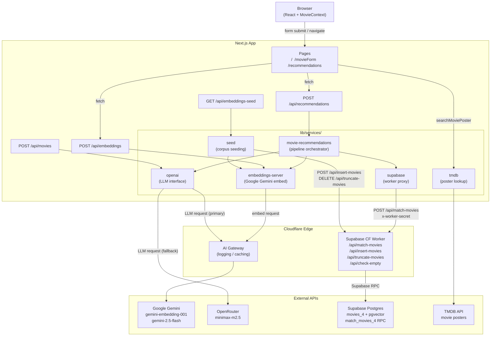
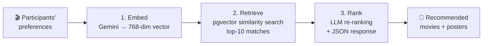
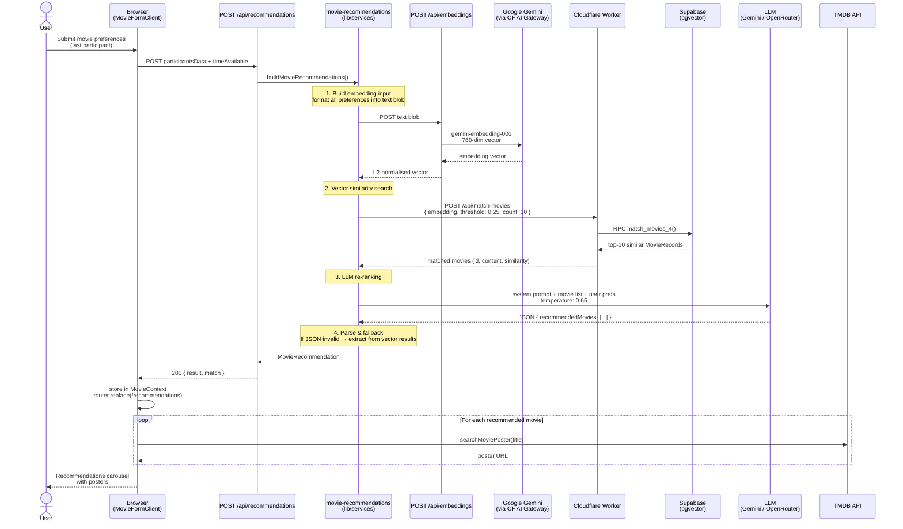

# PlotlineAI

PlotlineAI is a group movie recommendation app. Each participant shares their tastes -- favourite film, preferred era, current mood, and a favourite film personality -- and the system uses **embedding-based vector search** combined with a **language model** to surface movies the whole group will enjoy.

[](https://plotline-ai.vercel.app/)

## Table of Contents

- [Architecture](#architecture)
- [How It Works](#how-it-works)
- [Tech Stack](#tech-stack)
- [Getting Started](#getting-started)
- [Project Structure](#project-structure)
- [Cloudflare Workers](#cloudflare-workers)
- [AI Limitations](#ai-limitations)

---

## Architecture



> Full diagrams — React component tree and AI fallback circuit breaker → [`docs/diagrams.md`](./docs/diagrams.md)

---

## How It Works

The recommendation pipeline has three stages: **embed**, **retrieve**, and **rank**.



<details>
<summary>Detailed sequence diagram</summary>



</details>

### 1. Collect preferences

Each participant fills in:

- A **favourite movie** and why they love it
- **New vs classic** preference (2015-present or pre-2015)
- **Mood** (fun, serious, inspiring, or scary)
- A **favourite film person** they would want to be stranded on an island with

The group also sets how much **time** is available for the session.

### 2. Embed

All preferences are concatenated into a single text blob and sent to `POST /api/embeddings`. The server calls **Google Gemini** (`gemini-embedding-001`) via the Vercel AI SDK to produce a 768-dimensional vector. The returned vector is **L2-normalised** on the client before the next step.

### 3. Retrieve -- vector similarity search

The browser sends participant answers to `POST /api/recommendations`, and the server forwards the normalised vector to the **Supabase Cloudflare Worker** (`POST /api/match-movies`). That worker runs the Postgres RPC `match_movies_4`, using the pgvector `<=>` (cosine distance) operator against a pre-seeded corpus of movie embeddings and returning the **top 10 matches** above a 0.25 similarity threshold.

The movie corpus lives in `public/constants/movies.txt` and is chunked and embedded via the `/api/embeddings-seed` endpoint on first run.

### 4. Rank -- language model re-ranking

The matched movie content is split into individual entries and formatted as a "Movie List Context". This context, together with the original participant preferences, is sent to `POST /api/movies`, which calls **Google Gemini 2.5 Flash** (primary) to rank and filter the candidates. If Google is unavailable or its daily quota is exhausted (HTTP 429/403), the request automatically falls back to **MiniMax M2.5 via OpenRouter** (free tier). Quota errors trigger a 24-hour circuit breaker so subsequent requests skip Google until the quota resets.

A structured system prompt instructs the model to return between 1 and 10 movies as JSON, filtered by time constraints, era preference, mood, and genre fit.

### 5. Fallback and display

If the LLM response cannot be parsed as valid JSON, a **heuristic fallback** (`lib/utils/recommendations.ts`) extracts movie titles, years, and synopses directly from the raw vector-match text. Movie posters are fetched from the **TMDB API** and displayed in a carousel.

## Tech Stack

| Layer       | Technology                                                                                 |
| ----------- | ------------------------------------------------------------------------------------------ |
| Framework   | Next.js 16 (App Router, Turbopack)                                                         |
| UI          | React 19, Tailwind CSS, DaisyUI                                                            |
| AI          | Vercel AI SDK, Google Gemini (primary LLM + embeddings), OpenRouter MiniMax (fallback LLM) |
| Gateway     | Cloudflare AI Gateway (Google language model path)                                         |
| Database    | Supabase (Postgres + pgvector)                                                             |
| Edge worker | Cloudflare Workers                                                                         |
| Testing     | Jest 29, React Testing Library                                                             |
| Tooling     | TypeScript (strict), ESLint, Prettier, Husky, lint-staged                                  |

## Getting Started

### Prerequisites

- Node.js v22.13.1 or higher
- pnpm
- A Supabase project with the pgvector extension enabled
- API keys for Google Gemini and OpenRouter, plus TMDB
- A Cloudflare account for the AI Gateway

### Install

```bash
git clone https://github.com/CodeHunt101/plotline-ai.git
cd plotline-ai
pnpm install
```

### Environment variables

Create **`.env.local`** for the Next.js app:

```env
# Google Gemini -- primary language model + embeddings
GOOGLE_GENERATIVE_AI_API_KEY=

# OpenRouter -- fallback language model (used when Google is unavailable or quota-limited)
OPENROUTER_API_KEY=
OPENROUTER_LANGUAGE_MODEL=             # optional, defaults to minimax/minimax-m2.5:free

# Cloudflare AI Gateway (required for the primary Google language model)
CLOUDFLARE_ACCOUNT_ID=
CLOUDFLARE_GATEWAY_NAME=
CLOUDFLARE_API_KEY=                    # optional

# Supabase worker URL + shared secret used by server-side worker calls
SUPABASE_WORKER_URL=
SUPABASE_WORKER_SECRET=

# TMDB poster lookup
NEXT_PUBLIC_TMBD_ACCESS_TOKEN=
```

Create **`.dev.vars`** for the Cloudflare Supabase worker (see `.dev.vars.example`):

```env
SUPABASE_URL=
SUPABASE_API_KEY=
WORKER_SHARED_SECRET=              # must match SUPABASE_WORKER_SECRET
```

### Database setup

Enable the pgvector extension and create the movies table. The embedding provider is Google Gemini (`gemini-embedding-001`), which produces **768-dimensional** vectors.

```sql
create extension vector;

create table movies_4 (
  id bigserial primary key,
  content text,
  embedding vector(768)
);

create function match_movies_4(
  query_embedding vector(768),
  match_threshold float,
  match_count int
)
returns table (
  id bigint,
  content text,
  similarity float
)
language sql stable
as $$
  select
    id,
    content,
    1 - (movies_4.embedding <=> query_embedding) as similarity
  from movies_4
  where 1 - (movies_4.embedding <=> query_embedding) > match_threshold
  order by similarity desc
  limit match_count;
$$;
```

To verify the dimensions of an existing table:

```sql
select atttypmod from pg_attribute
where attrelid = 'movies_4'::regclass and attname = 'embedding';
```

### Development

Start the Next.js dev server and the Supabase worker:

```bash
pnpm dev
npx wrangler dev --config wrangler.supabase.toml
```

Then open [http://localhost:3000](http://localhost:3000).

To seed the movie corpus into Supabase on first run, call `GET /api/embeddings-seed` with the `x-worker-secret` header set to `SUPABASE_WORKER_SECRET`. This splits `public/constants/movies.txt` on movie boundaries (one entry per embedding), embeds each entry, and inserts them into the `movies_4` table if it is empty.

To force a full reseed (truncates existing data first), call `GET /api/embeddings-seed?force=true` with the same `x-worker-secret` header.

### Testing

```bash
pnpm test              # watch mode
pnpm test:ci           # single run (CI)
pnpm test:coverage     # coverage report -- 95% threshold enforced
```

### Deployment

Deploy the Next.js app to Vercel:

```bash
vercel
```

Deploy the Supabase worker to Cloudflare:

```bash
npx wrangler deploy --config wrangler.supabase.toml
```

### Supabase keepalive

This repo includes a GitHub Actions workflow at `.github/workflows/supabase-keepalive.yml` that runs a lightweight Postgres query once per day.

To enable it:

1. In GitHub, open **Settings -> Secrets and variables -> Actions**.
2. Add a repository secret named `SUPABASE_DB_URL`.
3. Paste your Supabase **transaction pooler** connection string from **Connect -> Transaction mode** in the Supabase dashboard.

The workflow also supports manual runs from the **Actions** tab via `workflow_dispatch`.

## Project Structure

```
plotline-ai/
├── app/
│   ├── (routes)/                 # UI pages
│   │   ├── page.tsx                # Home -- participant setup
│   │   ├── movieForm/page.tsx      # Per-person preference form
│   │   └── recommendations/page.tsx# Results carousel
│   ├── api/
│   │   ├── movies/route.ts         # LLM chat completion
│   │   ├── recommendations/route.ts# Server-side recommendation pipeline
│   │   ├── embeddings/route.ts     # Embedding generation
│   │   └── embeddings-seed/route.ts# Corpus seeding
│   ├── layout.tsx
│   └── globals.css
├── components/
│   ├── features/                 # Header, Logo, ParticipantsSetup, MovieFormFields
│   └── ui/                       # TextAreaField, TabGroup
├── contexts/                     # MovieContext (shared state)
├── constants/                    # MOVIE_TYPES, MOOD_TYPES, sample data
├── types/                        # TypeScript interfaces (api.ts, movie.ts)
├── lib/
│   ├── config/                   # ai.ts (model selection), supabase.ts
│   ├── services/                 # movies, embeddings, openai, supabase, seed, tmdb
│   └── utils/                    # recommendations.ts, urls.ts
├── workers/
│   └── supabase-worker.ts        # Cloudflare Worker for Supabase operations
├── public/
│   └── constants/movies.txt      # Movie corpus for embedding seeding
├── wrangler.supabase.toml
├── jest.config.js
├── tailwind.config.ts
└── package.json
```

## Cloudflare Workers

### Supabase Worker

The Supabase worker (`workers/supabase-worker.ts`, port 7878) proxies database operations so that Supabase credentials stay server-side:

- `POST /api/insert-movies` -- batch-insert chunked movie data during seeding. Requires `x-worker-secret`.
- `GET /api/check-empty` -- check whether the movies table needs seeding. Requires `x-worker-secret`.
- `POST /api/match-movies` -- run the pgvector similarity RPC and return the top matches. Requires `x-worker-secret`.
- `DELETE /api/truncate-movies` -- delete all rows from the movies table (used by force-reseed). Requires `x-worker-secret`.

### AI Gateway

Text generation calls to Google Gemini are routed through the **Cloudflare AI Gateway** for logging, caching, and rate limiting. The gateway is configured in `lib/config/ai.ts` using the `ai-gateway-provider` package. The OpenRouter fallback path does not use the gateway.

## AI Limitations

PlotlineAI uses artificial intelligence for movie recommendations, and while it strives for accuracy:

- Recommendations may not always perfectly match group preferences.
- Movie information and details might occasionally be incomplete or imprecise.
- The system works best with clear, detailed input from all participants.
- Results can vary based on the quality and specificity of user inputs.
