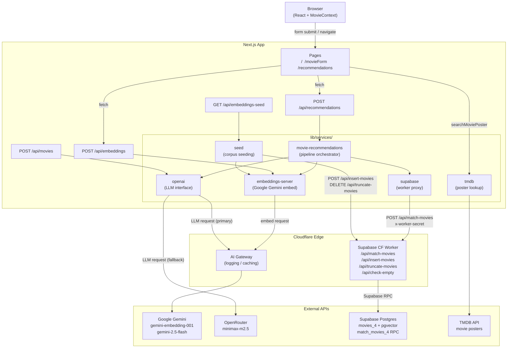
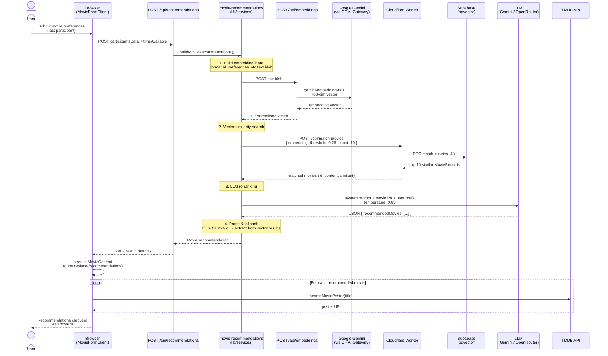
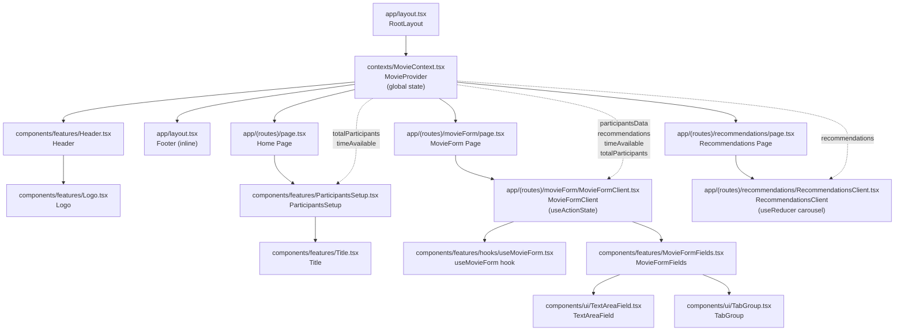
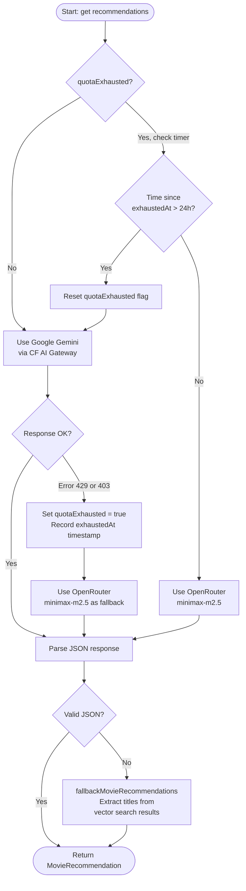

# PlotlineAI — Architecture Diagrams

## 1. System Architecture

High-level view of all layers: browser, Next.js, services, and external APIs.

---

## 2. Recommendation Pipeline

Step-by-step sequence from form submission to displaying results.

---

## 3. React Component Tree

Component hierarchy from root layout to leaf UI primitives.

---

## 4. AI Fallback Logic

Circuit breaker that switches from Google Gemini to OpenRouter on quota errors.

